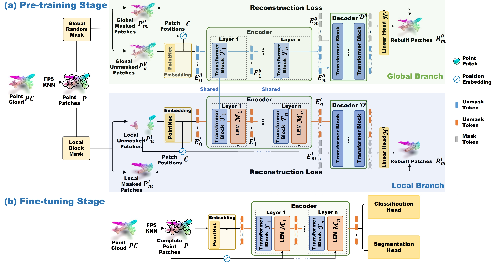

# Point-FEMAE: Towards Compact 3D Representations via Point Feature Enhancement Masked Autoencoders

[](https://paperswithcode.com/sota/few-shot-3d-point-cloud-classification-on-3?p=towards-compact-3d-representations-via-point)
[](https://paperswithcode.com/sota/few-shot-3d-point-cloud-classification-on-4?p=towards-compact-3d-representations-via-point)
[](https://paperswithcode.com/sota/3d-point-cloud-classification-on-modelnet40?p=towards-compact-3d-representations-via-point)
[](https://paperswithcode.com/sota/3d-point-cloud-classification-on-scanobjectnn?p=towards-compact-3d-representations-via-point)


This repository provides the official implementation of [**Towards Compact 3D Representations via Point Feature Enhancement Masked Autoencoders**](https://arxiv.org/abs/2312.10726) at AAAI 2024.


## 📨 News
- **[2023.12.10]** 🔥 Our paper **Point-FEMAE ([github](https://github.com/zyh16143998882/AAAI24-PointFEMAE))** has been accepted by **AAAI 2024**! 🎉🎉 Many thanks to all the collaborators and anonymous reviewers! 🤓
- **[2023.07.14]** 🔥 Our paper **IDPT ([github](https://github.com/zyh16143998882/ICCV23-IDPT))** has been accepted by **ICCV 2023**! 🎉🎉 Many thanks to all the collaborators and anonymous reviewers! 🥰

## 1. Introduction

Learning 3D  representation plays a critical role in masked autoencoder (MAE) based pre-training methods for point cloud, including single-modal and cross-modal based MAE methods. 
Specifically, although cross-modal MAE methods learn strong 3D representations via the auxiliary of other modal knowledge, they often suffer from heavy computational burdens and heavily rely on massive cross-modal data pairs that are often unavailable, which hinders their applications in practice. 
Instead, single-modal methods with solely point clouds as input are preferred in real applications due to their simplicity and efficiency. 
However, such methods easily suffer from \textit{limited 3D representations} with global random mask input. 
To learn compact 3D representations, we propose a simple yet effective Point Feature Enhancement Masked Autoencoders (Point-FEMAE), which mainly consists of a global branch and a local branch to capture latent semantic features. 
Specifically, to learn more compact features, a share-parameter Transformer encoder is introduced to extract point features from the global and local unmasked patches obtained by global random and local block mask strategies, followed by a specific decoder to reconstruct. 
Meanwhile, to further enhance features in the local branch, we propose a Local Enhancement Module with local patch convolution to perceive fine-grained local context at larger scales. 
Our method significantly improves the pre-training efficiency compared to cross-modal alternatives, and extensive downstream experiments underscore the state-of-the-art effectiveness, particularly outperforming our baseline (Point-MAE) by 5.16%, 5.00%, and 5.04% in three variants of ScanObjectNN, respectively. 



In the following, we will guide you how to use this repository step by step. 🤗

## 2. Preparation
```bash
git clone git@github.com:zyh16143998882/AAAI24-PointFEMAE.git
cd AAAI24-PointFEMAE/
```
### 2.1 Requirements
- gcc >= 4.9
- cuda >= 9.0
- python >= 3.7
- pytorch >= 1.7.0 < 1.11.0
- anaconda
- torchvision
```bash
conda create -y -n femae python=3.7
conda activate femae
pip install torch==1.8.0+cu111 torchvision==0.9.0+cu111 torchaudio==0.8.0 -f https://download.pytorch.org/whl/torch_stable.html
pip install -r requirements.txt

# Chamfer Distance & emd
cd ./extensions/chamfer_dist
python setup.py install --user
cd ./extensions/emd
python setup.py install --user

# PointNet++
pip install "git+https://github.com/erikwijmans/Pointnet2_PyTorch.git#egg=pointnet2_ops&subdirectory=pointnet2_ops_lib"

# GPU kNN
pip install --upgrade https://github.com/unlimblue/KNN_CUDA/releases/download/0.2/KNN_CUDA-0.2-py3-none-any.whl
pip install torch-scatter
```

### 2.2 Download the point cloud datasets and organize them properly
Before running the code, we need to make sure that everything needed is ready. 
First, the working directory is expected to be organized as below:

<details><summary>click to expand 👈</summary>

```
AAAI24-PointFEMAE/
├── cfgs/
├── data/
│   ├── ModelNet/ # ModelNet40
│   │   └── modelnet40_normal_resampled/
│   │       ├── modelnet40_shape_names.txt
│   │       ├── modelnet40_train.txt
│   │       ├── modelnet40_test.txt
│   │       ├── modelnet40_train_8192pts_fps.dat
│   │       └── modelnet40_test_8192pts_fps.dat
│   ├── ModelNetFewshot/ # ModelNet Few-shot
│   │   ├── 5way10shot/
│   │   │   ├── 0.pkl
│   │   │   ├── ...
│   │   │   └── 9.pkl
│   │   ├── 5way20shot/
│   │   │   ├── ...
│   │   │   ...
│   │   ├── 10way10shot/
│   │   │   ├── ...
│   │   │   ...
│   │   └── 10way20shot/
│   │       ├── ...
│   │       ...
│   ├── ScanObjectNN/ # ScanObjectNN
│   │   ├── main_split/
│   │   │   ├── training_objectdataset_augmentedrot_scale75.h5
│   │   │   ├── test_objectdataset_augmentedrot_scale75.h5
│   │   │   ├── training_objectdataset.h5
│   │   │   └── test_objectdataset.h5
│   │   └── main_split_nobg/
│   │       ├── training_objectdataset.h5
│   │       └── test_objectdataset.h5
│   ├── ShapeNet55-34/ # ShapeNet55/34
│   │   ├── shapenet_pc/
│   │   │   ├── 02691156-1a04e3eab45ca15dd86060f189eb133.npy
│   │   │   ├── 02691156-1a6ad7a24bb89733f412783097373bdc.npy
│   │   │   ├── ...
│   │   │   ...
│   │   └── ShapeNet-55/
│   │       ├── train.txt
│   │       └── test.txt
│   └── shapenetcore_partanno_segmentation_benchmark_v0_normal/ # ShapeNetPart
│       ├── 02691156/
│       │   ├── 1a04e3eab45ca15dd86060f189eb133.txt
│       │   ├── ...
│       │   ...
│       │── ...
│       │── train_test_split/
│       └── synsetoffset2category.txt
├── datasets/
├── ...
...
```
</details>

Here we have also collected the download links of required datasets for you:
- ShapeNet55/34 (for pre-training): [[link](https://github.com/lulutang0608/Point-BERT/blob/49e2c7407d351ce8fe65764bbddd5d9c0e0a4c52/DATASET.md)].
- ScanObjectNN: [[link](https://hkust-vgd.github.io/scanobjectnn/)].
- ModelNet40: [[link 1](https://github.com/lulutang0608/Point-BERT/blob/49e2c7407d351ce8fe65764bbddd5d9c0e0a4c52/DATASET.md)] (pre-processed) or [[link 2](https://modelnet.cs.princeton.edu/)] (raw).
- ModelNet Few-shot: [[link](https://github.com/lulutang0608/Point-BERT/blob/49e2c7407d351ce8fe65764bbddd5d9c0e0a4c52/DATASET.md)].
- ShapeNetPart: [[link](https://shapenet.cs.stanford.edu/media/shapenetcore_partanno_segmentation_benchmark_v0_normal.zip)].


## 3. Pre-train a point cloud model (e.g. Point-FEMAE)
To pre-train Point-FEMAE on ShapeNet, you can run the following command: 

```python
# CUDA_VISIBLE_DEVICES=<GPU> python main.py --config cfgs/pretrain_femae.yaml --exp_name <output_file_name>
CUDA_VISIBLE_DEVICES=0 python main.py --config cfgs/pretrain_femae.yaml --exp_name pretrain_pointmae
```
If you want to try other models or change pre-training configuration, e.g., mask ratios, just create a new configuration file and pass its path to `--config`.

For a quick start, we also have provided the pre-trained checkpoint of Point-FEMAE [[link](https://drive.google.com/drive/folders/1q0A-yXC1fmKKg38fbaqIxM79lvXpj4AO?usp=drive_link)].

## 4. Tune pre-trained point cloud models on downstream tasks


### 4.1 Object Classification

<details><summary>ModelNet40 (click to expand 👈)</summary>

```python
# CUDA_VISIBLE_DEVICES=<GPU> python main.py --config cfgs/finetune_modelnet_femae.yaml --finetune_model --exp_name <output_file_name> --ckpts <path/to/pre-trained/model>
CUDA_VISIBLE_DEVICES=0 python main.py --config cfgs/finetune_modelnet_femae.yaml --ckpts ./ckpts/pretrained/femae-epoch-300.pth --finetune_model --exp_name modelnet_femae

# further enable voting mechanism
CUDA_VISIBLE_DEVICES=0 python main.py --config cfgs/finetune_modelnet_femae.yaml --test --vote --exp_name modelnet_femae_vote --ckpts ./experiments/finetune_modelnet_femae/cfgs/modelnet_femae/ckpt-best.pth
```
</details>

<details><summary>ScanObjectNN (OBJ-BG) (click to expand 👈)</summary>

```python
# CUDA_VISIBLE_DEVICES=<GPU> python main.py --config cfgs/finetune_scan_objbg_femae.yaml --finetune_model --exp_name <output_file_name> --ckpts <path/to/pre-trained/model>
CUDA_VISIBLE_DEVICES=0 python main.py --config cfgs/finetune_scan_objbg_femae.yaml --ckpts ./ckpts/pretrained/femae-epoch-300.pth --finetune_model --exp_name bg_femae
```
</details>

<details><summary>ScanObjectNN (OBJ-ONLY) (click to expand 👈)</summary>

```python
# CUDA_VISIBLE_DEVICES=<GPU> python main.py --config cfgs/finetune_scan_objonly_femae.yaml --finetune_model --exp_name <output_file_name> --ckpts <path/to/pre-trained/model>
CUDA_VISIBLE_DEVICES=0 python main.py --config cfgs/finetune_scan_objonly_femae.yaml --ckpts ./ckpts/pretrained/femae-epoch-300.pth --finetune_model --exp_name only_femae
```
</details>

<details><summary>ScanObjectNN (PB-T50-RS) (click to expand 👈)</summary>

```python
# CUDA_VISIBLE_DEVICES=<GPU> python main.py --config cfgs/finetune_scan_hardest_femae.yaml --finetune_model --exp_name <output_file_name> --ckpts <path/to/pre-trained/model>
CUDA_VISIBLE_DEVICES=0 python main.py --config cfgs/finetune_scan_hardest_femae.yaml --ckpts ./ckpts/pretrained/femae-epoch-300.pth --finetune_model --exp_name hard_femae
```
</details>


### 4.2 Few-shot Learning on ModelNet Few-shot
<details><summary>Few-shot (click to expand 👈)</summary>

```python
# CUDA_VISIBLE_DEVICES=<GPU> python main.py --config cfgs/fewshot_femae.yaml --finetune_model --ckpts <path/to/pre-trained/model> --exp_name <output_file_name> --way <5 or 10> --shot <10 or 20> --fold <0-9>
for WAY in 5 10
do
  for SHOT in 10 20
  do
    for FOLD in $(seq 0 9)
    do
      CUDA_VISIBLE_DEVICES=0 python main.py --config cfgs/fewshot_femae.yaml --finetune_model --ckpts ./ckpts/pretrained/femae-epoch-300.pth --exp_name fewshot_femae --way ${WAY} --shot ${SHOT} --fold ${FOLD}
    done
  done
done
```
</details>


### 4.3 Part Segmentation on ShapeNet-Part

<details><summary>Part Segmentation (click to expand 👈)</summary>

```python
cd segmentation

# python main.py --model pt_hmae_s1 --ckpts <path/to/pre-trained/model> --log_dir path/to/data --batch_size 16 --gpu 0
python main.py --model pt_hmae_s1 --ckpts ../ckpts/pretrained/femae-epoch-300.pth --log_dir seg_femae --batch_size 16 --gpu 0
```
</details>


## 5. Validate with checkpoints
For reproducibility, logs and checkpoints of fine-tuned models of Point-FEMAE can be found in the table below.


| Task              | Dataset           | Parameters            | log                                                                                                                   | Acc.       | Checkpoints Download                                                                                     |
|-------------------|-------------------|-----------------------|-----------------------------------------------------------------------------------------------------------------------|------------|----------------------------------------------------------------------------------------------------------|
| Pre-training      | ShapeNet          | 41.5M                 | -                                                                                                                     | N.A.       | [Point-FEMAE](https://drive.google.com/drive/folders/1q0A-yXC1fmKKg38fbaqIxM79lvXpj4AO?usp=drive_link)       |
| Classification    | ScanObjectNN      | 27.4M                 | [finetune_scan_objbg.log](https://drive.google.com/drive/folders/1RfJDGc7158P82QXSmkMlcbKSB_IUAjFd?usp=drive_link)      | 95.18%     | [OBJ-BG](https://drive.google.com/drive/folders/1RfJDGc7158P82QXSmkMlcbKSB_IUAjFd?usp=drive_link)          |
| Classification    | ScanObjectNN      | 27.4M                 | [finetune_scan_objonly.log](https://drive.google.com/drive/folders/1h6HU531GOapsQdJy8ykeVjp-59JhLq7F?usp=drive_link)    | 93.29%     | [OBJ-ONLY](https://drive.google.com/drive/folders/1h6HU531GOapsQdJy8ykeVjp-59JhLq7F?usp=drive_link)        |
| Classification    | ScanObjectNN      | 27.4M                 | [finetune_scan_hardest.log](https://drive.google.com/drive/folders/1SCfXUs3D85Hjejm8xuwYyIGTt80RqYnE?usp=drive_link)    | 90.22%     | [PB-T50-RS](https://drive.google.com/drive/folders/1SCfXUs3D85Hjejm8xuwYyIGTt80RqYnE?usp=drive_link)       |
| Classification    | ModelNet40        | 27.4M                 | [finetune_modelnet.log](https://drive.google.com/drive/folders/1vBm_zHq9xfQnTrBQ6Cu-o5fWK9YW9U3b?usp=drive_link)        | 94.04%     | [ModelNet-1k](https://drive.google.com/drive/folders/1vBm_zHq9xfQnTrBQ6Cu-o5fWK9YW9U3b?usp=drive_link)     |
| Classification    | ModelNet40 (vote) | -                     | [finetune_modelnet_vote.log](https://drive.google.com/drive/folders/11Nb2X6aoaEDDjlCK72cNwNjGowDVdGYb?usp=drive_link)   | 94.49%     | [ModelNet-1k](https://drive.google.com/drive/folders/11Nb2X6aoaEDDjlCK72cNwNjGowDVdGYb?usp=drive_link)   |

| Task              | Dataset    | log                                      | 5w10s (%)  | 5w20s (%)  | 10w10s (%) | 10w20s (%) | 
|-------------------|------------|------------------------------------------|------------|------------|------------|------------|
| Few-shot learning | ModelNet40 | [fewshot_logs](https://drive.google.com/drive/folders/1HnhhyoXxRY14r9aOnVQBhaQcqkkvqtpO?usp=drive_link) | 97.2±1.9 | 98.6±1.3 | 94.0±3.3 | 95.8±2.8 |

| Task              | Dataset      | log                                      | mIoUc  | mIoUi  | Checkpoints Download                                                                                     |
|-------------------|--------------|------------------------------------------|------------|------------|------------|
| Parg Segmentation | ShapeNetPart | [parg segmentation](https://drive.google.com/drive/folders/1GZB0EUTngmV-5MID4YHUOlqSsX0A6X2K?usp=drive_link) | 84.9  | 86.3 |[parg segmentation](https://drive.google.com/drive/folders/1GZB0EUTngmV-5MID4YHUOlqSsX0A6X2K?usp=drive_link)|


<!-- 💡***Notes***: For classification downstream tasks, we randomly select 5 seeds to obtain the best checkpoint. -->

The evaluation commands with checkpoints should be in the following format:
```python
CUDA_VISIBLE_DEVICES=<GPU> python main.py --test --config <yaml_file_name> --exp_name <output_file_name> --ckpts <path/to/ckpt>
```

<details><summary>For example, click to expand 👈</summary>

```python
# object classification on ScanObjectNN (PB-T50-RS)
CUDA_VISIBLE_DEVICES=0 python main.py --config cfgs/finetune_scan_hardest_femae.yaml --ckpts ./ckpts/hardest/ckpt-best.pth --test --exp_name hard_test

# object classification on ScanObjectNN (OBJ-BG)
CUDA_VISIBLE_DEVICES=0 python main.py --config cfgs/finetune_scan_objbg_femae.yaml --ckpts ./ckpts/bg/ckpt-best.pth --test --exp_name bg_test

# object classification on ScanObjectNN (OBJ-ONLY)
CUDA_VISIBLE_DEVICES=0 python main.py --config cfgs/finetune_scan_objonly_femae.yaml --ckpts ./ckpts/only/ckpt-best.pth --test --exp_name only_test

# object classification on ModelNet40 (w/o voting)
CUDA_VISIBLE_DEVICES=0 python main.py --config cfgs/finetune_modelnet_femae.yaml --ckpts ./ckpts/modelnet40/ckpt-best.pth --test --exp_name model_test

# object classification on ModelNet40 (w/ voting)
CUDA_VISIBLE_DEVICES=0 python main.py --config cfgs/finetune_modelnet_femae.yaml --test --vote --exp_name modelnet_femae_vote --ckpts ./ckpts/modelnet40_vote/ckpt-best.pth

# few-show learning on ModelNet40
python parse_test_res.py ./ckpts/fewshot/fewshot --multi-exp --few-shot
```
</details>

## 6. Bibliography

If you find this code useful or use the toolkit in your work, please consider citing:

```
@article{zha2023towards,
  title={Towards Compact 3D Representations via Point Feature Enhancement Masked Autoencoders},
  author={Zha, Yaohua and Ji, Huizhen and Li, Jinmin and Li, Rongsheng and Dai, Tao and Chen, Bin and Wang, Zhi and Xia, Shu-Tao},
  journal={arXiv preprint arXiv:2312.10726},
  year={2023}
}
```

and closely related work IDPT (ICCV 2023):

```
@article{zha2023instance,
  title={Instance-aware Dynamic Prompt Tuning for Pre-trained Point Cloud Models},
  author={Zha, Yaohua and Wang, Jinpeng and Dai, Tao and Chen, Bin and Wang, Zhi and Xia, Shu-Tao},
  journal={arXiv preprint arXiv:2304.07221},
  year={2023}
}
```

## 7. Acknowledgements

Our codes are built upon [Point-MAE](https://github.com/Pang-Yatian/Point-MAE), [DGCNN](https://github.com/WangYueFt/dgcnn). Thanks for their efforts.

## 8. Contact
If you have any question, you can raise an issue or email Yaohua Zha (chayh21@mails.tsinghua.edu.cn). We will reply you soon.